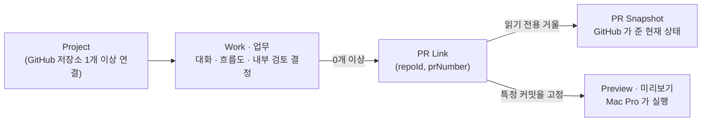

# 0단계 — 계약 정의: 업무 하나와 PR 하나가 어떻게 이어지는가

> 한 줄 요지: **Agent Studio 의 모든 화면은 "업무(Work)" 를 중심으로 돌고, 코드의 현재 상태는 언제나 GitHub 의 PR 을 그대로 비춘 것이다.** Studio 가 스스로 갖는 것은 업무·대화·내부 검토 결정·미리보기뿐이고, 브랜치·커밋·검사·병합 상태는 Studio 가 만들지도 고치지도 않는다.

이 문서는 사용자 워크플로우 기획안([`../product/user-workflow-plan.html`](../product/user-workflow-plan.html)) 의 개발 순서 **0 · 계약 정의** 에 해당한다. 기술 스택과 무관하게 먼저 정해 두어야 하는 개념과 규칙만 담는다. 여기서 "계약" 이란 화면·서버·GitHub 연동이 서로 무엇을 주고받는지에 대한 약속을 말한다.

## 1. 왜 이 계약이 먼저인가

이 제품이 태어난 문제는 하나다. Claude 클라우드 세션 여러 개가 브랜치와 PR 을 스스로 만들면서, **어느 PR 이 어느 업무의 것인지, 무엇이 최신인지**를 사람이 잃어버렸다. 그러므로 첫 번째로 정할 것은 화면이 아니라 "업무와 PR 을 잇는 규칙" 이다. 이 규칙이 흔들리면 어떤 화면을 만들어도 같은 혼란이 재현된다.

## 2. 개념 — 다섯 가지

| 개념 | 정의 | 누가 만들고 누가 고치나 |
|---|---|---|
| **Project** | 사용자가 Studio 에서 만든 프로젝트. GitHub 저장소를 하나 이상 연결한다. | 사용자가 만든다 |
| **Work (업무)** | 목표 하나를 가진 작업 단위. 시안의 `flow` 가 이것이다. 대화(Chat), 단계 흐름도(Flow), 연결된 PR 목록, 내부 검토 결정이 한 업무에 모인다. | 사용자 또는 Studio 가 만들고, Studio 가 소유한다 |
| **PR Link** | 업무와 GitHub PR 을 잇는 연결. 식별자는 **저장소 ID 와 PR 번호의 쌍**이다. 브랜치 이름은 식별자가 아니다. | Studio 가 자동으로, 또는 사용자가 Inbox 에서 만든다 |
| **PR Snapshot** | GitHub 가 알려 준 PR 의 현재 상태(열림·병합·닫힘, 최신 커밋, 검사 결과, 리뷰 상태). Studio 는 이것을 **읽기만** 한다. | GitHub 가 만들고, Studio 는 받아 적는다 |
| **Preview (미리보기)** | 특정 PR 의 **특정 커밋**을 Mac Pro 가 실행한 결과. 접근이 제한된 주소로 사용자 기기에서 연다. | Studio 가 요청하고 Mac Pro 가 실행한다 |

Agent 와 Skill 은 이 단계에서 **데이터로만** 존재한다(이름, 소개, 지시문, 모델 참조, 스킬 목록). 실행은 3단계에서 붙는다.

## 3. 식별 규칙 — 무엇으로 "같은 것" 을 판단하나

1. **PR 은 (저장소 ID, PR 번호) 로만 같다.** 저장소 5개에 같은 이름의 브랜치가 있어도 서로 다른 PR 이다. 저장소는 이름(`owner/repo`)이 아니라 GitHub 가 부여한 숫자 ID 로 기억한다. 이름은 바뀔 수 있기 때문이다.
2. **커밋은 SHA 로만 같다.** 미리보기와 내부 검토 결정은 반드시 커밋 SHA 를 함께 기록한다. "이 PR 을 봤다" 가 아니라 "이 PR 의 이 커밋을 봤다" 가 기록 단위다.
3. **업무는 Studio 가 발급한 ID 로 같다.** 제목이 같아도 다른 업무다.

## 4. 자동 연결 규칙 — 추측하지 않는다

외부(Claude 클라우드, 동료의 로컬)에서 만들어진 PR 이 Studio 에 들어올 때, 어느 업무의 것인지 판단하는 규칙이다. **원칙은 "확실할 때만 자동, 아니면 Inbox"** 다. 잘못 붙인 PR 은 놓친 PR 보다 해롭다. 사람이 그 오류를 발견할 방법이 없기 때문이다.

| 상황 | 처리 |
|---|---|
| PR 본문 또는 브랜치 이름에 Studio 가 발급한 업무 표식이 **정확히 하나** 있고, 그 업무가 **같은 프로젝트**에 있다 (예: `studio-work-8f2a1c`) | 그 업무에 자동 연결. 표식은 Studio 가 업무를 만들 때 사용자에게 보여 주고, 사용자는 PR 을 만들 때 그것을 넣는다 |
| PR 을 Studio 자신이 만들었다 (3단계 이후) | 자동 연결 |
| PR 이 복제본(fork)의 브랜치에서 왔거나, 복제본인지 알 수 없다 | 표식이 있어도 **Inbox**. 팀 밖의 누구나 표식을 적을 수 있기 때문이다(결정 10) |
| 사람이 그 PR 의 연결을 푼 적이 있다(Unlink) | 표식이 있어도 **Inbox**. 사람이 다시 연결할 때까지 자동으로 붙이지 않는다(결정 9) |
| 그 밖의 모든 경우 | **Inbox** 에 "프로젝트의 새 PR" 로 둔다. 사용자가 "기존 업무에 연결" 또는 "새 업무 만들기" 를 고른다 |

표식의 형식은 `studio-work-<업무 ID>` 하나다. 콜론 같은 문자는 git 브랜치 이름에 쓸 수 없으므로, 본문과 브랜치 이름 양쪽에 그대로 들어가는 글자만 쓴다(2026-09-25 수정 — 처음 적은 예시 `studio:work-8f2a` 는 브랜치 이름으로 쓸 수 없었다). 표식이 가리키는 업무가 없거나, 다른 프로젝트의 업무이거나, 서로 다른 업무를 가리키는 표식이 둘 이상이면 자동 연결하지 않고 Inbox 로 보낸다.

제목 유사도, 파일 겹침, 작성자 같은 **추정 근거로는 자동 연결하지 않는다.** 이 제한은 첫 버전의 의도된 선택이다. 추정을 넣고 싶다면 그것은 새 결정이다.

## 5. 상태 분리 — Studio 의 상태와 GitHub 의 상태는 다른 열에 둔다

같은 화면에 두 종류의 상태가 함께 보이므로, 어느 것이 누구의 것인지 이름부터 갈라 둔다.

| 상태의 주인 | 상태 | 값 | 바꾸는 방법 |
|---|---|---|---|
| **Studio (업무)** | 업무 상태 | 초안 · 진행 중 · 검토 필요 · 완료 | 사용자의 조작, 또는 연결된 PR 의 변화에 Studio 가 반응 |
| **Studio (내부 검토 결정)** | 검토 결정 | 수정 요청 · 내부 검토 완료 | 사용자가 Review 화면에서 남긴다. 어느 커밋 SHA 에 대한 결정인지 함께 저장한다 |
| **GitHub (PR Snapshot)** | PR 상태 | 열림 · 병합됨 · 닫힘 | GitHub 에서만 바뀐다. Studio 는 받아 적는다 |
| **GitHub (PR Snapshot)** | 검사 · 리뷰 | 통과 · 실패 · 진행 중 / 승인 · 변경 요청 | 위와 같다 |

**Studio 의 "내부 검토 완료" 는 GitHub 병합을 뜻하지 않는다.** 화면은 두 상태를 나란히 보여 주되 한 문장으로 합치지 않는다. 예를 들어 "내부 검토 완료 · GitHub 병합 대기" 처럼 두 열로 표시한다.

## 6. 신선도 규칙 — 무엇이 "오래된 것" 이 되나

PR 에 새 커밋이 올라오면, 그 전 커밋을 근거로 만든 것은 자동으로 오래된 것이 된다.

- **미리보기**: 실행 중인 커밋 SHA 가 PR 의 최신 커밋과 다르면 "이전 버전" 으로 표시하고, 검토 근거로 쓰지 않는다. 사용자가 최신 커밋으로 다시 실행한다.
- **내부 검토 결정**: 결정에 적힌 커밋 SHA 가 최신이 아니면 "이전 커밋에 대한 결정" 으로 표시한다. 자동으로 지우지는 않는다. 기록은 남되 현재 판단으로 읽히지 않게 한다.
- **첫 버전의 미리보기는 동시에 1개** 다. 다른 PR 을 실행하면 이전 미리보기를 종료하고 사용자에게 알린다.

## 7. Studio 가 하지 않는 것 — 경계를 글로 박아 둔다

1. **브랜치를 만들지 않고, 병합하지 않고, 강제 푸시하지 않는다.** 첫 버전의 GitHub 권한은 PR · 커밋 · 검사 · 리뷰 상태를 **읽는** 범위로 제한한다.
2. **PR 을 추측으로 업무에 붙이지 않는다.** (4절)
3. **연결이 검증되지 않은 AI 모델을 선택지에 보이지 않고, 실행되지 않는 Run 버튼을 두지 않는다.** 실제 실행은 3단계에서, 공식 클라이언트에 사용자가 직접 로그인한 경로로만 붙인다.
4. **토큰을 복사하거나 저장하지 않는다.** 구독 인증은 공식 클라이언트가 갖고, Studio 는 그 클라이언트를 부를 뿐이다.

## 8. 이 계약이 통과해야 할 확인 시나리오

기획안의 "출시 판단" 을 계약 수준으로 옮긴 것이다. 구현이 어떤 스택이든 아래를 만족해야 0단계가 끝난다.

1. 저장소 5개에 같은 이름의 브랜치로 PR 이 하나씩 열려 있을 때, 다섯 PR 이 서로 섞이지 않고 각각의 프로젝트에 보인다.
2. 업무 표식이 없는 외부 PR 은 어떤 업무에도 자동으로 붙지 않고 Inbox 에 나타난다.
3. 사용자가 Inbox 에서 PR 을 기존 업무에 연결하면, 그 업무의 Chat 과 Workspace 에 PR 카드가 나타난다.
4. PR 에 새 커밋이 올라오면, 이전 커밋의 미리보기와 내부 검토 결정이 "이전 버전" 으로 표시된다.
5. Studio 에서 "내부 검토 완료" 를 남겨도 GitHub 의 PR 상태는 바뀌지 않고, 화면은 두 상태를 따로 보여 준다.

## 9. 이 문서가 정하지 않은 것

- 기술 스택, 데이터베이스, 배포 위치. ([`../../decisions.md`](../../decisions.md) 의 열린 결정 참고)
- GitHub 연결 방식의 세부(GitHub App 의 권한 목록, 웹훅과 주기 조회의 병행 여부). 1단계 설계에서 정한다.
- Mac Pro 미리보기의 실행 방식(격리 폴더, 포트, 접근 제한 주소). 2단계 설계에서 정한다.
