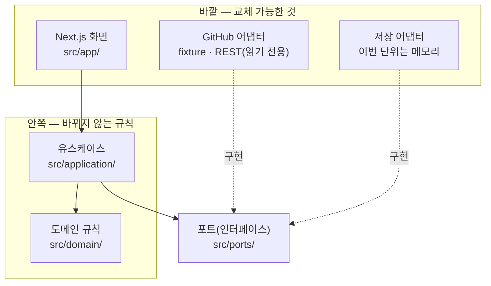

# 1단계 — PR 모으기: 첫 번째 완결 단위

> 한 줄 요지: **첫 단위는 "GitHub 에서 읽어 온 PR 이 업무에 붙어 Workspace 에 보이고, 어느 업무의 것인지 모르는 PR 은 Inbox 에서 사람이 연결한다" 까지를 화면 배선까지 끝낸다.** 진짜 GitHub 자격증명이 없어도 전부 검증되도록, GitHub 는 읽기 전용 포트 뒤에 두고 고정 데이터(fixture) 로 먼저 돌린다.

이 문서는 [`00-domain-contract.md`](./00-domain-contract.md) 의 계약을 코드로 옮기는 첫 단위의 범위와 통과 기준이다. 기술 스택은 결정 8(TypeScript · Next.js · PostgreSQL)을 따른다.

## 1. 왜 이렇게 잘랐나

작업은 예고 없이 끊길 수 있다. 그래서 "로직을 다 만들고 나중에 화면을 붙이는" 순서 대신, 작은 기능 하나를 화면 배선까지 끝내는 순서로 자른다. 이 단위가 끝나면 사용자는 브라우저에서 PR 이 업무에 모이는 모습을 직접 볼 수 있다. 저장(PostgreSQL)과 진짜 GitHub 인증은 다음 단위다. 이번 단위의 저장은 서버 메모리라서 서버를 다시 켜면 처음 상태로 돌아가며, 화면이 그 사실을 표시한다.

## 2. 구조 — 클린 아키텍처의 네 층

- **도메인(`src/domain/`)** 은 계약의 규칙 그 자체다. 식별 규칙, 표식 판정, 상태 분리, 신선도 판정이 여기 있다. Next.js · GitHub · 데이터베이스를 import 하지 않는다.
- **유스케이스(`src/application/`)** 는 "프로젝트를 동기화한다", "Inbox 의 PR 을 업무에 연결한다", "PR 로 새 업무를 만든다" 같은 사용자 행동 단위다. 도메인과 포트만 안다.
- **포트(`src/ports/`)** 는 바깥 세계와의 약속이다. `GitHubReader` 에는 **읽는 메서드만** 있다. 쓰는 메서드가 포트에 없으므로, Studio 가 GitHub 의 상태를 바꾸는 코드는 구조적으로 쓸 수 없다(결정 4).
- **어댑터** 는 포트를 구현한다. GitHub 어댑터는 두 개다. 고정 데이터로 도는 fixture 어댑터와, GitHub REST API 를 GET 요청으로만 부르는 REST 어댑터다. REST 어댑터는 GET 이 아닌 요청을 보내려 하면 보내기 전에 오류를 낸다.

## 3. 이번 단위의 범위

| 들어가는 것 | 들어가지 않는 것 (다음 단위 이후) |
|---|---|
| Next.js + TypeScript 골격, 단위 테스트(Vitest), 진입점에서 출발하는 e2e 테스트(Playwright), CI 워크플로 | PostgreSQL 저장 어댑터와 첫 마이그레이션 |
| 계약의 도메인 모델과 규칙, 확인 시나리오 5개의 테스트 | GitHub App 설치 · 설치 토큰 발급 · 웹훅 수신 |
| `GitHubReader` 포트, fixture 어댑터, GET 전용 REST 어댑터(가짜 응답으로 시험) | 미리보기(Preview) 실행 — 2단계 |
| 화면 세 개: Workspace(업무와 PR 카드), Inbox(연결 안 된 PR), 업무 화면(그 업무의 PR 카드) | Chat 대화 · Flow 흐름도 · Agents 화면의 실제 구현 |
| 창고 환경 표준 파일 반입(`.env.example` · `compose.local.yml` · `db/migrations/`) | 내부 검토 결정(Review) 을 남기는 버튼 — 도메인 규칙과 테스트만 이번에 넣는다 |

## 4. 통과 기준 — 이것이 되면 이 단위는 끝난다

**계약의 확인 시나리오 5개가 자동 테스트로 통과한다.**

1. 저장소 5개에 같은 이름의 브랜치로 PR 이 하나씩 있을 때, 다섯 PR 이 서로 섞이지 않고 각각의 프로젝트에 보인다. 저장소 이름이 바뀌어도(숫자 ID 는 같음) 같은 PR 로 취급된다.
2. 업무 표식이 없는 외부 PR 은 어떤 업무에도 자동으로 붙지 않고 Inbox 에 나타난다. 표식이 없는 업무를 가리키거나, 다른 프로젝트의 업무를 가리키거나, 서로 다른 업무를 가리키는 표식이 둘이면 역시 Inbox 로 간다.
3. Inbox 에서 PR 을 기존 업무에 연결하면, 그 업무의 화면과 Workspace 에 PR 카드가 나타나고 Inbox 에서는 사라진다. "New Work" 로 PR 에서 새 업무를 만들어도 같다.
4. PR 에 새 커밋이 올라오면, 이전 커밋에 대한 미리보기 기록과 내부 검토 결정이 "이전 버전" 으로 판정된다(기록은 지워지지 않는다).
5. 내부 검토 완료를 남겨도 GitHub 의 PR 상태는 바뀌지 않고, 두 상태는 서로 다른 필드로 따로 보인다.

**화면에서 확인할 수 있다.**

- 첫 화면(Workspace)에서 출발해 클릭만으로 Inbox 에 가고, PR 하나를 업무에 연결하고, 그 PR 카드가 업무 화면과 Workspace 에 나타나는 것을 볼 수 있다. 이 흐름을 e2e 테스트가 진입점부터 끝까지 구동한다.
- PR 카드는 Studio 의 상태와 GitHub 의 상태를 다른 줄(또는 열)에 보여 주고, 한 문장으로 합치지 않는다.
- 데이터의 출처(fixture 인지 GitHub 인지)와 "서버를 다시 켜면 처음 상태로 돌아간다" 는 사실이 화면에 보인다. 동작하지 않는 버튼(Run, Open Preview 등)은 화면에 두지 않는다.

**구조를 기계가 지킨다.**

- 도메인과 유스케이스 폴더가 Next.js · 어댑터 · 외부 라이브러리를 import 하지 않는지 테스트가 확인한다.
- REST 어댑터가 GET 이외의 요청을 보내지 못하는지 테스트가 확인한다.
- 타입 검사, 단위 테스트, e2e 테스트, 빌드가 CI 에서 돈다.

## 5. 진행 결과와 이번 단위에서 채택한 기본값 (2026-09-25)

첫 완결 단위는 두 번의 검증을 거쳤다. 독립 적대 검증이 테스트 구멍(규칙을 일부러 깨도 통과하던 변이 4건)과 메모리 저장소의 내부 객체 노출을 찾았고, 사용자 관점 QA 가 화면 혼란 12건을 찾았다. 2차 수정 뒤 단위 테스트 102건과 e2e 6건이 통과하며, 1차에 살아남았던 변이는 모두 잡힌다. 남은 한계는 진짜 GitHub 로는 한 번도 돌려 보지 않았다는 것이다.

아래는 되돌리기 쉬워 사람에게 묻지 않고 기본값으로 정한 것이다. 바꾸고 싶으면 이 표의 한 행만 고치면 된다.

| 결정 내용 | 채택한 기본값과 이유 | 되돌리기 |
|---|---|---|
| 표식 앞뒤에 글자가 붙은 경우 | 밑줄 · 모든 언어의 글자 · 숫자가 붙으면 표식이 아니다. 조사를 붙여 쓴 `studio-work-a1b2c3에서` 도 표식이 아니므로 화면 안내에 "표식 앞뒤는 띄어 쓴다" 를 둔다. 틀리면 Inbox 로 가는 안전한 쪽이다 | 쉬움 |
| 같은 업무로 다시 연결하는 요청(이중 클릭) | 거절하지 않고 성공으로 처리한다. 다른 업무로의 재연결은 거절한다 | 쉬움 |
| 표식으로 연결된 뒤 표식이 바뀌거나 지워진 PR | 연결을 유지한다. 동기화는 이미 있는 연결을 바꾸지 않는다 | 쉬움 |
| New Work 의 업무 제목 | PR 제목을 그대로 쓰고 초안(Draft) 상태로 시작한다 | 쉬움 |
| Last sync 시각 | 한국 시간(KST)으로 표시한다 | 쉬움 |
| REST 모드의 프로젝트 | `GITHUB_REPOS` 에 적은 저장소마다 프로젝트를 하나씩 만든다. 프로젝트를 만드는 화면이 아직 없어서다 | 쉬움 |
| REST 로 읽는 양 | 저장소마다 최근 PR 50개, 커밋마다 검사 100개, PR 마다 리뷰 100개. 페이지 넘김은 아직 하지 않는다 | 쉬움 |
| TypeScript 판 | 5.9. 7.0 은 Next.js 빌드가 쓰는 JavaScript API 를 싣지 않는다 | 쉬움 |
| `next dev` 가 CLAUDE.md 에 블록을 덧붙이는 기능 | `next.config.ts` 의 `agentRules: false` 로 끈다 | 쉬움 |

사람의 결정이 필요한 것(잘못 연결한 PR 되돌리기, fork PR 의 표식 자동 연결, Inbox 에 닫힌 PR 을 둘지)은 이 단위의 보고에서 따로 올렸다.
