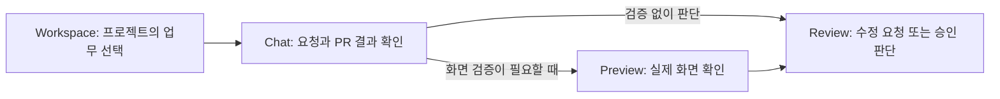
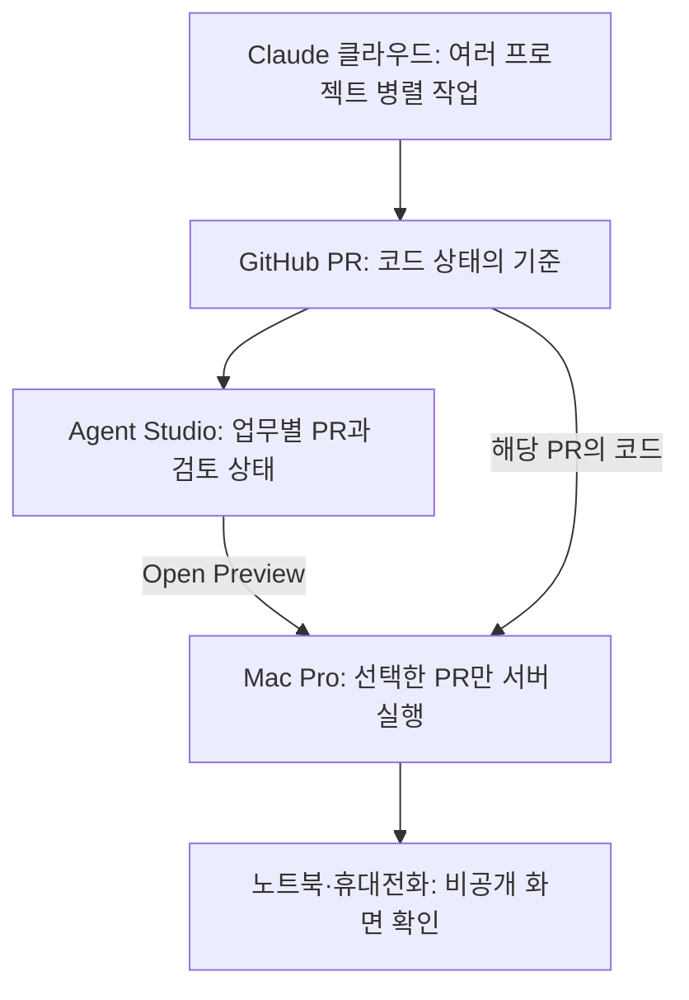

# Agent Studio | CEO 브리핑

2026-09-23 · 비전공자 의사결정용 · 기존 기술 구현 계획의 요약

> **제안:** 여러 AI 세션과 코드 변경을 **업무별로 한곳에 모으고**, 필요한 결과만 실제 서버에서 열어 검증한다. GitHub는 팀의 코드와 검토 기록을 모으는 곳이고, PR은 코드 변경을 검토하고 합치기 위한 제안서다. 사용자는 `Workspace → Chat → Preview → Review`만 알면 된다.

## 1. 해결할 문제와 제품의 답

| 지금 겪는 문제 | Agent Studio가 제공할 경험 |
| --- | --- |
| Claude 클라우드에서 5개 이상의 프로젝트를 병렬로 진행하면 세션마다 별도의 코드 작업과 PR이 생겨, 어느 결과가 최신인지 놓친다. | 프로젝트별 업무에 **현재 PR·검사 결과·검토 필요 여부**를 연결한다. 코드 상태는 GitHub를 기준으로 다시 확인한다. |
| 노트북에서 서버를 띄워야 화면 검증이 쉬운데, 밖에서는 그 노트북에 묶인다. | 선택한 PR을 접속 가능한 개발용 컴퓨터(**Mac Pro 우선**)에서 실행하고, 노트북이나 휴대전화에서 비공개 Preview를 연다. |
| 관리 절차와 화면이 늘어나면 오히려 업무가 복잡해진다. | 기존 시안의 `Workspace`, `Chat`, `Flow`를 그대로 사용한다. 복잡한 브랜치·세션 정보는 문제가 생겼을 때만 보여준다. |

**제품의 역할:** GitHub를 대체하는 도구가 아니라, **“이 업무의 다음 결정이 무엇인가”를 보여주는 작업 공간**이다. 일반 업무는 PR 없이 같은 화면을 사용한다.

## 2. 사용자는 어떻게 일하는가

1. **어디서나 병렬 작업:** Claude 웹에서 여러 프로젝트를 진행한다. 각 작업이 GitHub에 올린 PR을 Agent Studio가 해당 업무에 표시한다.
2. **한곳에서 상태 확인:** `Workspace`에서 검토할 업무를 고르고 `Chat`에서 대화와 PR, 검사 결과를 함께 본다.
3. **필요한 것만 실행:** 화면 확인이 필요한 PR에서 `Open Preview`를 누른다. 개발용 컴퓨터가 해당 PR의 정확한 코드 버전을 실행한다.
4. **사람이 결정:** Preview를 보고 수정 요청을 남긴다. 최종 병합은 GitHub에서 사람이 결정한다.

`Flow`는 에이전트의 작업 단계나 역할을 바꾸고 싶을 때만 연다. PR 연결이 불분명하거나 충돌이 날 때만 `Inbox`에서 확인을 요청한다. **첫 버전은 이미 만들어진 PR을 가져오는 것부터 시작**하므로, 앱 안의 AI `Run` 버튼은 실제 실행 연결이 검증된 뒤에 제공한다.

## 3. 클라우드와 실제 서버는 어떻게 이어지는가

이렇게 하면 **클라우드의 병렬성**과 **실제 서버 검증**을 함께 얻는다. 개발용 컴퓨터는 모든 프로젝트를 항상 실행할 필요가 없다. 검토할 PR만 켜고, 사용자의 노트북은 접속 단말로 사용한다. 로컬에서 수정한 내용은 GitHub에 올려야 다른 기기와 클라우드 작업에 이어진다. 같은 브랜치를 클라우드와 로컬에서 동시에 수정하면 자동으로 합치지 않고 충돌을 알린다.

## 4. 지금의 프로토타입에 무엇을 붙이는가

| 기존 화면 | 첫 제품에 추가할 내용 | 사용자에게 보이는 변화 |
| --- | --- | --- |
| `Workspace` | 프로젝트별 업무와 대표 상태 | “검토 필요”한 일을 먼저 찾음 |
| `Chat` | 해당 업무의 PR 카드와 조건부 `Open Preview` | 대화, 코드 결과, 화면 검증을 같은 자리에서 확인 |
| `Flow` | 개발 업무의 간단한 진행 단계 | 필요할 때만 단계와 담당 역할을 조정 |
| `Inbox` | 연결이 애매한 PR, 충돌, 승인 요청 | 예외가 생겼을 때만 확인 |

**현재 상태:** 지금의 HTML은 클릭해 볼 수 있는 시안이다. GitHub 동기화, 실제 AI 실행, 서버 Preview는 아직 연결되어 있지 않다. 위 표는 앞으로 연결할 제품 동작이다.

## 5. 무엇을 먼저 만들고, 언제 다음 단계로 가는가

| 순서 | 사용자에게 생기는 결과 | 다음 단계로 넘어갈 기준 |
| --- | --- | --- |
| **준비** | 새 조작 없음 | 기존 PR을 읽고 Mac Pro에서 해당 코드의 서버를 한 번 실행. 필요한 접근 권한 확인 |
| **① PR 연결** | 여러 프로젝트의 업무에서 PR 상태를 봄 | **5개 이상**의 저장소가 섞이지 않음. 앱 밖 Claude 웹에서 만든 PR도 발견하고 연결하거나 확인 대상으로 표시 |
| **② Preview 연결** | `Open Preview`로 실제 화면 확인 | **PR 한 건**의 정확한 코드 버전을 Mac Pro에서 실행하고 다른 기기에서 확인. 실패도 같은 업무에 표시 |
| **③ AI 실행** | `Chat`의 `Run`으로 새 작업 시작 | 공식 실행 경로, 사용자별 로그인, 중지·승인·비용 경계가 작은 시험에서 검증된 뒤 활성화 |
| **④ 확장** | 다른 실행기·개발 호스트 선택 | 팀 사용과 추가 공급사, 예비 클라우드 개발 환경은 실제 수요·정책·비용 검증 후 결정 |

**첫 제품의 성공 판정은 ①과 ②다.** 다섯 프로젝트의 PR을 혼동 없이 보고, 그중 하나를 휴대전화에서도 열어 실제 화면을 검증할 수 있으면 첫 번째 사용 가치를 입증한다. 브랜치 자동 생성, 자동 병합, 여러 개발 호스트 운영은 성공 판정에 포함하지 않는다.

## 6. 경영진이 알아야 할 운영 원칙

- **코드의 최종 상태는 GitHub:** Claude 세션의 “작업 완료”와 PR의 “병합 완료”는 다르게 표시한다. GitHub와 화면이 어긋나면 다시 조회한다.
- **첫 연결은 읽기 중심:** 앱이 PR을 먼저 찾아 보여준다. 자동 병합·강제 변경은 도입하지 않는다. 최종 병합 권한은 사람에게 남긴다.
- **Preview는 선택적으로:** Mac Pro의 접속 가능 시간·성능을 먼저 확인한다. 컴퓨터가 꺼져 있으면 Preview를 사용할 수 없으므로, 필요성이 확인되면 다른 개발 호스트를 추가한다.
- **AI 구독 연동은 검증 뒤에:** 공식 실행기의 로그인·이용 범위·사용량 제한을 확인한다. 기존 구독이 모든 자동화 작업이나 외부 API 비용을 포함한다고 가정하지 않는다.

**바로 시작할 검증:** 현재 시안의 개발 업무 하나에 GitHub 저장소와 기존 PR 한 건을 연결하고, 그 PR의 Preview를 Mac Pro에서 열어 휴대전화로 확인한다. 이 흐름이 작동하면 동일한 PR 확인 방식을 나머지 프로젝트로 확장한다.
