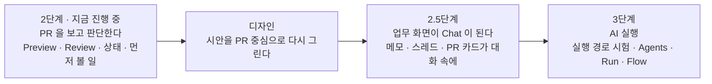
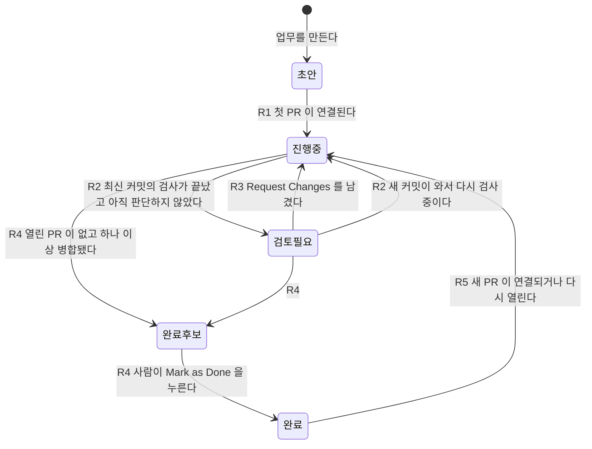

# 기능 기획서 — 2단계의 남은 것, 2.5단계(사람의 Chat), 3단계(AI 실행)

> 한 줄 요지: **Agent Studio 는 앞으로 세 걸음을 간다. 2단계에서는 "PR 을 보고 판단하는 도구"를 완성하고(Review 버튼, 업무 상태가 스스로 바뀌기, 먼저 볼 일 모아 보기), 2.5단계에서는 업무 화면을 사람끼리 메모와 스레드를 남기는 Chat 으로 바꾸며, 3단계에서야 AI 실행과 Flow 흐름도를 붙인다.** 이 문서는 그 순서와 각 기능의 모양을 사용자가 확정하기 위한 초안이다. 확정되면 디자이너가 시안을 이 방향으로 다시 그리고, 그 시안이 확정된 뒤에 개발한다.

- 작성: 2026-09-27 · 상태: **확정 — 2026-09-28 사용자 컨펌 (9절 C1~C8 모두 권고대로)**. 결정 로그의 결정 13 · 14 · 15 로 옮겨 적었다.
- 읽는 데 걸리는 시간: 약 20분. 바쁘면 1절과 9절(컨펌 체크리스트)만 읽어도 된다.

---

## 1. 이 문서가 확정하려는 것

이 문서가 사용자에게 받으려는 답은 **"무엇을 어느 단계에 만들고, 화면이 어떤 뼈대를 갖는가"** 다. 버튼의 색이나 정확한 문구, 데이터베이스 설계의 세부는 여기서 정하지 않는다. 그것은 각각 디자인과 개발 단계의 몫이다.

| 이 문서가 정하는 것 | 이 문서가 정하지 않는 것 |
|---|---|
| 기능마다 몇 단계에 들어가는가 | 화면의 색 · 간격 · 정확한 문구 (디자인 단계) |
| 기능마다 "누가 무엇을 누르면 무엇이 보이나" | 데이터베이스 표의 칸 이름 (개발 단계) |
| 메뉴가 언제 나타나는가, 업무 화면이 어떻게 Chat 이 되는가 | 3단계 AI 실행의 기술 세부 (실행 경로 시험 뒤) |
| 업무 상태가 스스로 바뀌는 규칙 (계약에 새로 적을 것) | 배포 위치, 팀 여러 명의 로그인 방식 (별도 결정) |

### 이 문서가 전제로 삼은 기본값 — 모두 컨펌 대상이다

앞선 논의에서 사용자가 받아들인 기본값이다. 이 문서 전체가 이 위에 서 있으므로, 하나라도 "아니오"면 해당 절을 다시 쓴다.

| 번호 | 기본값 | 상태 |
|---|---|---|
| 전제 1 | AI 없이 사람끼리 쓰는 Chat(메모 · 스레드)은 **2.5단계**에 만든다 | 받아들임, 컨펌 대상 |
| 전제 2 | Flow 흐름도는 **3단계**에, AI 실행과 함께 만든다 | 받아들임, 컨펌 대상 |
| 전제 3 | 시안은 PR 중심 방향으로 **새로 그린다** (이 문서 컨펌 뒤 디자이너가) | 받아들임, 컨펌 대상 |
| 전제 4 | Review 버튼(Request Changes · Approve)을 **2단계 안에** 넣는다 | **2단계 추가 제안 — 아직 승인 전** |

### 전체 그림



2단계 개발은 이 기획 · 디자인과 **나란히** 계속한다. 다만 2단계에 새로 넣자고 제안하는 기능(2절의 표에서 "추가 제안"으로 표시한 것)은 이 문서가 컨펌된 뒤에 착수한다.

---

## 2. 단계별 기능 목록

기능마다 다섯 가지를 적는다. **사용자 이야기**(누가 · 무엇을 하려고 · 무엇을 누르면 · 무엇이 보이나), **화면 위치**, **규칙**(계약 문서 [`../plan/00-domain-contract.md`](../plan/00-domain-contract.md) 와 [`../../decisions.md`](../../decisions.md) 의 결정과 어떻게 이어지는가), **통과 기준**, **의존하는 것**.

### 2-1. 한눈에 보기

| 단계 | 기능 | 상태 |
|---|---|---|
| 2 | F1. Preview 실기기 확인 (Mac Pro · 휴대전화) | 만들어짐, **실기기 미확인** |
| 2 | F2. Review 버튼 (Request Changes · Approve) | **추가 제안 — 승인 필요** |
| 2 | F3. 업무 상태가 스스로 바뀐다 | **추가 제안 — 승인 필요** |
| 2 | F4. Needs your attention (먼저 볼 일 모아 보기) | **추가 제안 — 승인 필요** |
| 2 | F5. New Work (빈 업무 만들기와 표식 복사) | **추가 제안 — 승인 필요** |
| 2 | F6. 주기 Sync | 결정 11 에 이미 있음, 미구현 |
| 2.5 | F7. 업무 화면을 Chat 으로 바꾸기 (PR 카드가 대화 속에) | 전제 1 |
| 2.5 | F8. 메모 쓰기 | 전제 1 |
| 2.5 | F9. 스레드 (메모와 PR 카드에 답글) | 전제 1 |
| 3 | F10. 실행 경로 시험 (첫 단위) | 전제 2, 결정 3 · 5 |
| 3 | F11. Agents | 결정 7 |
| 3 | F12. Run (Chat 에서 AI 에게 일 맡기기) | 결정 2 · 3 |
| 3 | F13. Flow 흐름도 | 전제 2 |
| 보류 | 여러 저장소를 한 프로젝트로 묶는 화면, PR 없는 일반 업무, 웹훅, 동시 여러 미리보기, 팀 여러 명 로그인 | 3-5절 |
| 삭제 | 시안의 예시 업무(고객 문의 · 채용 페이지), 실행되지 않는 Run 버튼 | 3-5절 |

F2 에서 F5 까지를 2단계에 넣자고 제안하는 이유는 하나다. **지금 제품은 PR 을 "보여 주기"만 하고, 사용자가 그 PR 을 보고 "판단을 남길" 자리가 없다.** 결정 5 의 성공 기준(PR 을 혼동 없이 보고, 하나를 휴대전화에서 검증한다)을 채운 뒤 사용자가 실제로 매일 쓰려면, 본 것에 대한 판단을 남기고(F2) 그 판단이 업무의 상태에 반영되고(F3) 다음에 볼 일이 모이는 것(F4)까지가 한 묶음이다. 모두 대화나 AI 없이 성립하므로 2.5단계를 기다릴 이유가 없다.

### 2-2. 2단계 — 남은 것

#### F1. Preview 실기기 확인

- **사용자 이야기**: 사용자가 밖에서 휴대전화로 PR 의 실제 화면을 확인하려고, 업무 화면의 PR 카드에서 `Open Preview` 를 누르고 준비되면 `Open` 을 누른다. 휴대전화에 그 PR 커밋의 앱 화면이 뜬다.
- **화면 위치**: 업무 화면의 PR 카드 (이미 있음).
- **규칙**: 계약 §6(신선도, 동시 미리보기 1개), 결정 10(복제본 PR 은 실행하지 않는다). 만들어진 것의 설명은 [`../plan/04-remote-preview.md`](../plan/04-remote-preview.md).
- **통과 기준**: Mac Pro 에서 Studio 를 띄우고, 사설망으로 연결된 휴대전화에서 미리보기 주소를 열어 PR 커밋의 화면을 본다. 이 확인이 끝나야 결정 5 의 두 번째 성공 기준이 채워진다.
- **의존하는 것**: Mac Pro 와 휴대전화, 사설망 설정. **사람만 할 수 있는 일**이 들어 있다.

#### F2. Review 버튼 — 추가 제안, 승인 필요

- **사용자 이야기**: 사용자가 PR 의 화면을 확인한 뒤 판단을 남기려고, PR 카드의 `Approve` 또는 `Request Changes` 를 누른다. 카드에 "내부 검토 완료 · 커밋 a1b2c3d" 또는 "수정 요청 · 커밋 a1b2c3d" 가 보이고, 그 옆에 GitHub 의 상태("GitHub 병합 대기")가 **따로** 보인다.
- **화면 위치**: 업무 화면의 PR 카드. 2.5단계 이후에는 Chat 속 PR 카드.
- **규칙**: 계약 §5 — 내부 검토 결정은 Studio 의 것이고 GitHub 병합을 뜻하지 않는다. 결정은 "이 PR 의 이 커밋"에 대한 것이므로 커밋을 함께 남긴다(계약 §3-2). 새 커밋이 오면 앞선 결정은 "이전 커밋에 대한 결정"으로 표시된다(계약 §6). 이 규칙은 이미 코드에 있다(`src/application/review.ts`). 버튼 이름은 결정 2 의 `Approve` · `Request Changes` 를 쓰되, `Approve` 옆에 "내부 검토 완료 — GitHub 병합이 아니다"를 작게 붙인다. GitHub 의 승인과 헷갈리지 않게 하려는 것이다.
- **통과 기준**: 버튼을 누르면 결정이 저장되고 카드에 보인다. GitHub 의 PR 상태는 바뀌지 않는다(계약 §8-5). 새 커밋이 오면 결정이 "이전 커밋"으로 표시된다. 첫 화면에서 출발하는 e2e 가 확인한다.
- **의존하는 것**: 없음. 규칙 · 저장 칸 · 표시 칸이 이미 있어 가장 작은 단위다.

#### F3. 업무 상태가 스스로 바뀐다 — 추가 제안, 승인 필요

- **사용자 이야기**: 사용자가 업무 다섯 개 중 어디를 봐야 하는지 알려고 Workspace 를 연다. 업무마다 "진행 중 · 검토 필요 · 완료" 같은 상태가 PR 의 변화에 따라 이미 바뀌어 있다. 지금은 모든 업무가 늘 "초안"이다.
- **화면 위치**: Workspace 의 업무 목록, 업무 화면 제목 옆.
- **규칙**: 계약 §5 는 업무 상태가 "연결된 PR 의 변화에 Studio 가 반응"해서 바뀔 수 있다고만 적고, **어떤 변화에 어떻게 반응하는지는 적지 않았다.** 그 규칙을 이 문서 4절에서 초안으로 제안한다. 확정되면 계약 §5 에 새로 적는다.
- **통과 기준**: 4절 표의 규칙마다 시험이 하나씩 있다. 사용자가 손으로 바꾼 상태가 다음 Sync 에 조용히 덮이지 않는다(4절의 규칙 R6).
- **의존하는 것**: F2(검토 결정이 상태 규칙의 재료다).

#### F4. Needs your attention — 추가 제안, 승인 필요

- **사용자 이야기**: 사용자가 아침에 "오늘 내가 판단할 것"만 보려고 Workspace 를 연다. 맨 위 칸에 검토가 필요한 업무, 검사가 실패한 PR, 이전 버전이 된 미리보기, Inbox 에서 기다리는 PR 개수가 모여 있다. 항목을 누르면 그 업무로 간다.
- **화면 위치**: Workspace 맨 위.
- **규칙**: 이 칸은 **새 상태를 만들지 않고** 이미 있는 상태(업무 상태, PR 검사 결과, 미리보기 신선도, Inbox)를 모아 보여 주기만 한다. 결정 6 의 "예외만 사람에게 올린다"를 첫 화면에서 지키는 장치다. 모을 것이 없으면 "지금 판단할 일이 없다"를 보인다.
- **통과 기준**: 네 종류의 항목이 각각 나타나고, 누르면 해당 업무나 Inbox 로 간다. 비어 있을 때의 문장이 보인다.
- **의존하는 것**: F3(검토 필요 상태가 있어야 이 칸의 첫 줄이 생긴다).

#### F5. New Work — 추가 제안, 승인 필요

- **사용자 이야기**: 사용자가 Claude 클라우드에서 새 작업을 시작하기 전에, 그 작업의 PR 이 자동으로 업무에 붙게 하려고 Workspace 에서 `New Work` 를 누르고 제목을 적는다. 빈 업무가 생기고, 화면에 표식(`studio-work-…`)과 `Copy` 버튼이 보인다. 사용자는 그 표식을 Claude 에게 주는 지시에 붙여 넣는다.
- **화면 위치**: Workspace 의 프로젝트 칸. 지금은 Inbox 에서 PR 을 받아 업무를 만드는 길만 있다.
- **규칙**: 계약 §4 — 표식이 있으면 자동 연결된다. 이 기능은 "표식을 사용자에게 보여 준다"는 계약의 약속을 처음으로 화면에 채운다. 결정 2 의 `New Flow` 이름은 3단계에서 Flow 가 생길 때까지 `New Work` 로 쓴다(**컨펌 대상**, 9절).
- **통과 기준**: 빈 업무를 만들고, 표식을 복사해 넣은 PR 이 다음 Sync 에서 그 업무에 자동으로 붙는다. 표식을 넣지 않은 PR 은 Inbox 로 간다.
- **의존하는 것**: 없음.

#### F6. 주기 Sync

- **사용자 이야기**: 사용자가 버튼을 누르지 않아도 PR 이 최신이도록, Studio 가 정해진 간격(기본 5분, 추정)마다 GitHub 를 읽는다. 위쪽 띠에 "마지막 동기화 3분 전"이 보인다.
- **화면 위치**: 위쪽 Sync 띠 (이미 있음).
- **규칙**: 결정 11 — 웹훅 없이 Sync 버튼과 주기 동기화로 가져온다. 읽기(GET)만 한다.
- **통과 기준**: 간격이 지나면 스스로 동기화하고, 실패하면 띠에 이유가 보인다. 수동 Sync 와 겹쳐 두 번 돌지 않는다.
- **의존하는 것**: 없음. F3 의 자동 상태 변화가 실제로 "스스로" 보이려면 이것이 있어야 한다.

### 2-3. 2.5단계 — 사람의 Chat

2.5단계의 목표는 **업무 하나의 맥락이 한 화면의 시간 순서로 읽히게 하는 것**이다. 지금 업무 화면은 PR 카드 목록이라 "왜 이 PR 이 있고, 누가 무엇을 판단했나"가 남지 않는다. Chat 은 그 맥락을 남기는 자리다. **이 단계의 Chat 입력은 AI 에게 가지 않는다.** 화면 입력칸에 "메모는 AI 에게 전달되지 않는다"를 보인다 — 결정 7 의 "겉으로만 있는 칸을 두지 않는다"를 지키려는 것이다.

#### F7. 업무 화면을 Chat 으로 바꾸기

- **사용자 이야기**: 사용자가 업무의 흐름을 되짚으려고 업무를 연다. 가운데에 시간 순서의 타임라인이 있고, 그 안에 "PR #12 가 연결됨", "새 커밋 a1b2c3d", "검사 실패", "내부 검토 완료", "병합됨" 같은 **PR 카드와 이벤트**가 대화처럼 흐른다.
- **화면 위치**: 업무 화면 전체. 3절의 화면 구조안 참고.
- **규칙**: 이벤트는 Studio 가 GitHub 에서 **읽은 변화**를 기록한 것이다. 계약 §5 대로 GitHub 의 상태는 받아 적기만 하고, 이벤트 카드의 모양으로 Studio 의 상태와 GitHub 의 상태를 구분한다. PR 카드의 버튼(Open Preview · Approve · Request Changes)은 **가장 최근 카드 하나에서만** 누를 수 있다. 과거 카드는 기록이다.
- **통과 기준**: 기존 업무 화면의 모든 기능(PR 카드, Preview, Review, Unlink)이 Chat 안에서 그대로 동작한다. 이벤트가 중복 없이 시간 순서로 쌓인다.
- **의존하는 것**: F2, F6. 이벤트를 쌓으려면 "무엇이 바뀌었나"를 저장해야 한다(5절).

#### F8. 메모 쓰기

- **사용자 이야기**: 사용자가 나중의 자신이나 동료에게 판단의 이유를 남기려고, 업무의 입력칸에 "로그인 화면 문구 다시 확인 필요"라고 적고 `Send` 를 누른다. 메모가 타임라인에 작성자와 시각과 함께 쌓인다.
- **화면 위치**: 업무 Chat 아래 입력칸.
- **규칙**: 메모는 Studio 가 소유한다(결정 4: Studio 는 업무 · 대화를 소유). 작성자는 첫 버전에서 "나" 한 명이다. 팀 여러 명이 쓰려면 로그인이 필요하고, 그것은 보안 관문이므로 별도 결정이다(`## 결정 필요` 2).
- **통과 기준**: 메모가 저장되어 다시 열어도 남는다. 고치기와 지우기의 허용 여부는 디자인 단계에서 정한다(기본값: 고치기 가능, 지우면 "지워진 메모" 자리만 남김).
- **의존하는 것**: F7.

#### F9. 스레드

- **사용자 이야기**: 사용자가 특정 PR 카드나 메모에 대한 이야기만 따로 이어 가려고, 그 항목의 `Reply` 를 누른다. 오른쪽에 그 항목의 스레드가 열리고, 답글은 메인 타임라인을 어지럽히지 않는다(Slack 방식, 결정 2).
- **화면 위치**: 업무 Chat 오른쪽 패널.
- **규칙**: 스레드는 한 단계만(답글에 답글은 같은 스레드). PR 카드에 단 스레드는 **그 커밋의 카드**에 붙는다 — 새 커밋이 오면 새 카드가 생기고, 옛 스레드는 옛 카드에 남는다. 계약 §3-2 의 "이 PR 의 이 커밋" 원칙을 대화에도 적용한 것이다.
- **통과 기준**: 스레드를 열고 답글을 달고 닫을 수 있다. 메인 타임라인의 항목에 답글 개수가 보인다.
- **의존하는 것**: F8.

### 2-4. 3단계 — AI 실행 (방향 수준)

3단계는 이 문서에서 **방향만** 정한다. 세부는 첫 단위인 실행 경로 시험(F10)의 결과를 본 뒤 따로 기획한다. 결정 5 가 순서를 이렇게 둔 이유(이전 경험에서 화면을 먼저 완성한 뒤 인증 연결에서 막혔다)가 그대로 적용된다.

| 기능 | 방향 | 지켜야 할 결정 |
|---|---|---|
| **F10. 실행 경로 시험** (첫 단위) | Mac Pro 에서 사용자가 직접 로그인한 공식 Claude Code 를 Studio 가 불러, 작은 일 하나를 시키고 결과를 받아 온다. 중지 · 사용량 한도 · 실패 시 표시를 함께 확인한다. **화면은 만들지 않는다.** 결과 보고가 곧 산출물이다 | 결정 3 (공식 클라이언트, 토큰 복사 금지), 결정 5 |
| **F11. Agents** | 이름 · What it does(소개, 사람용) · Instructions(지시문, AI 용) · AI model(Runtime · Model · Access) · Skills. 선택지에는 F10 에서 실제로 연결이 확인된 모델만 보인다 | 결정 3 · 7 |
| **F12. Run** | 업무 Chat 에서 Agent 를 골라 `Run` 을 누르면 AI 가 일을 하고, 진행과 결과가 같은 타임라인에 쌓인다. 결과 PR 은 업무 표식을 달고 올라와 자동 연결된다. `Run` 이라는 이름은 이때 처음 화면에 나온다 | 결정 2 (`Run` 은 실제 실행이 붙을 때만), 계약 §4 |
| **F13. Flow** | 업무 하나의 단계 흐름도. Agent · Skill · Review · Output 노드를 배치한다(Dify 방식). 노드가 실제로 실행되는 순서가 되므로 F12 뒤에 온다 | 결정 1 · 2 |

**3단계에서 새로 결정해야 할 것 하나를 미리 적어 둔다.** 계약 §7 은 "Studio 는 브랜치를 만들지 않는다"고 적었다. AI 가 일을 하면 누군가는 브랜치와 PR 을 만든다. 그 주체가 Studio 가 아니라 **사용자가 로그인한 공식 클라이언트(Claude Code)** 라면 계약과 충돌하지 않지만, 이 해석을 계약에 명시해야 한다. F10 의 결과와 함께 결정으로 올린다.

### 2-5. 보류와 삭제

| 항목 | 처리 | 이유와 다시 볼 조건 |
|---|---|---|
| 여러 저장소를 한 프로젝트로 묶는 화면 | 보류 | 데이터 모델은 이미 저장소 여러 개를 받는다(`Project.repoIds`). 지금은 저장소 하나가 프로젝트 하나로 충분하다. 프론트엔드와 백엔드를 다른 저장소로 나눈 프로젝트가 생기면 다시 본다 |
| PR 없는 일반 업무 (문서 · 기획) | 보류 | CEO 브리프는 "일반 업무는 PR 없이 같은 화면"이라 적었다. 2.5단계 Chat 이 생기면 자연히 가능해지므로 그때 범위에 넣을지 본다 |
| 웹훅 | 보류 | 결정 11. 공개 주소가 생길 때 |
| 동시에 여러 미리보기, 다른 개발 호스트 | 보류 | 계약 §6, 결정 5. Mac Pro 하나로 부족하다는 실측이 나오면 |
| 팀 여러 명 로그인 | 보류 → 결정 필요 | 2.5단계 Chat 을 "동료와 함께" 쓰려면 필요하다. 보안 관문이다 |
| 제목 유사도 같은 추정으로 PR 자동 연결 | 하지 않음 | 계약 §4 가 금지한다. 하려면 새 결정 |
| 시안의 예시 업무 (고객 문의 · 채용 페이지) | 삭제 | 제품 방향(결정 4 · 5)과 다르다. 새 시안의 예시는 실제 개발 업무로 바꾼다 |
| 실행되지 않는 Run 버튼, 연결 안 된 모델 선택지 | 삭제 | 결정 7. 3단계 F10 이 통과하기 전에는 화면에 두지 않는다 |

---

## 3. 화면 구조안 — 디자이너가 시안을 다시 그릴 때의 입력

### 3-1. 메뉴는 기능이 실제로 동작할 때만 나타난다

지금 위쪽 메뉴에는 Workspace 와 Inbox 두 개만 있다(`src/app/nav.tsx`). 아직 없는 화면은 메뉴에 두지 않는다는 원칙(결정 7, CLAUDE.md §4-4)을 단계마다 그대로 적용한다.

| 메뉴 | 2단계 | 2.5단계 | 3단계 |
|---|---|---|---|
| **Workspace** | 있음. 맨 위에 Needs your attention, 아래에 프로젝트별 업무 | 같음. 업무를 누르면 그 업무의 Chat 이 열린다 | 같음. 업무마다 실행 중인 Run 표시가 더해진다 |
| **Inbox** | 있음 | 있음 | 있음. 승인 요청(AI 가 사람의 확인을 기다리는 것)이 더해진다 |
| **Chat** | 없음 (업무 화면이 그 자리) | **나타남.** 왼쪽에 프로젝트별 업무 채널 목록 | 같음. 입력칸 옆에 Agent 선택과 `Run` 이 더해진다 |
| **Flow** | 없음 | 없음 | **나타남** |
| **Agents** | 없음 | 없음 | **나타남** (F10 통과 뒤) |

**Chat 을 별도 메뉴로 둘지, Workspace 에서 업무를 누르면 열리는 화면으로만 둘지**는 디자이너에게 열어 둔다. 이 문서의 기본값은 "메뉴에도 두고, Workspace 에서 눌러도 같은 화면이 열린다"이다. Slack 처럼 왼쪽 채널 목록에서 업무를 옮겨 다니는 동선이 매일 쓰기에 짧기 때문이다.

### 3-2. 업무 화면이 Chat 으로 바뀌는 방식

2단계의 업무 화면과 2.5단계의 Chat 은 **같은 주소, 같은 업무**다. 바뀌는 것은 배치뿐이다.

```
2단계 업무 화면                         2.5단계 Chat
┌──────────────────────────────┐        ┌────────┬──────────────────────────┬─────────────┐
│ 업무 제목 · 상태 · 표식 Copy   │        │ 채널    │ 업무 제목 · 상태 · 표식    │ 스레드       │
├──────────────────────────────┤        │ 목록    ├──────────────────────────┤ (열었을 때만) │
│ [PR 카드 #12]                 │        │         │ 09:10 PR #12 연결됨       │             │
│  검사 · GitHub 리뷰 · 병합     │        │ 프로젝트 │ [PR 카드 #12 · a1b2c3d]  │ PR #12 에   │
│  내부 검토 결정                │        │  └ 업무  │ 10:02 메모: 문구 확인 필요 │ 대한 답글    │
│  Open Preview · Approve ·     │        │  └ 업무  │ 11:30 새 커밋 → 새 카드   │             │
│  Request Changes · Unlink     │        │         │ [PR 카드 #12 · e4f5a6b]  │             │
│ [PR 카드 #15]                 │        │         ├──────────────────────────┤             │
│                               │        │         │ 메모 입력칸 · Send         │             │
└──────────────────────────────┘        └────────┴──────────────────────────┴─────────────┘
```

- 업무 제목 줄(상태 · 표식)은 두 단계 모두 맨 위에 있다.
- 2단계의 PR 카드 목록은 2.5단계에서 **타임라인 속의 카드**가 된다. 같은 PR 의 새 커밋은 새 카드로 쌓이고, 버튼은 최신 카드에만 살아 있다.
- 위쪽 띠(Sync 상태, Preview device 상태)는 모든 화면에 그대로 둔다.

### 3-3. PR 카드가 대화 속에 들어가는 방식

카드 하나는 **"이 PR 의 이 커밋"** 이다. 카드 안에서 두 주인의 상태를 가로로 나란히, 섞지 않고 보인다(계약 §5).

| 카드의 칸 | 주인 | 예 |
|---|---|---|
| PR 제목, 저장소, 번호, 커밋 앞 7자리 | GitHub | `admin-console #12 · a1b2c3d` |
| PR 상태 · 검사 · GitHub 리뷰 | GitHub | 열림 · 검사 실패 · 리뷰 없음 |
| 내부 검토 결정 | Studio | 내부 검토 완료 (이 커밋) |
| 미리보기 | Studio | 실행 중 · 주소 / 이전 버전 |
| 버튼 | — | Open Preview · Approve · Request Changes · Unlink (최신 카드에서만) |

- 과거 카드는 흐리게 보이고 "이전 커밋"이 표시된다.
- 카드 아래에 스레드 답글 개수가 붙는다.
- 누를 수 없는 버튼은 숨기지 않고 비활성으로 두고, 바로 옆에 이유를 한 줄로 보인다. 2단계 Preview 에서 이미 쓰고 있는 방식이다([`../plan/04-remote-preview.md`](../plan/04-remote-preview.md) §2).

### 3-4. 디자이너에게 넘기는 제약 요약

1. 버튼 · 기능 이름은 영어, 사용자가 쓰는 내용은 한국어(결정 2). 회색 계열과 강조색 하나.
2. 실행되지 않는 버튼, 연결 안 된 모델, 아직 없는 메뉴를 그리지 않는다(결정 7). 단계별 시안이 필요하면 단계마다 한 장씩 그린다.
3. Studio 의 상태와 GitHub 의 상태를 한 문장이나 한 배지로 합치지 않는다(계약 §5).
4. 예시 데이터는 실제 개발 업무(저장소 · PR · 커밋)로 쓴다. 고객 문의 · 채용 페이지 예시는 쓰지 않는다.
5. 휴대전화 화면을 함께 그린다. 휴대전화에서 미리보기를 여는 것이 성공 기준의 일부다(결정 5).

---

## 4. 업무 상태가 스스로 바뀌는 규칙 — 초안

업무 상태는 네 가지다(계약 §5): **초안 · 진행 중 · 검토 필요 · 완료.** 아래 규칙은 확정되면 계약 §5 에 새로 적는다. 판단의 재료는 모두 이미 있는 것이다 — 연결된 PR 의 상태(GitHub 가 준 것)와 내부 검토 결정(Studio 가 가진 것).



| 규칙 | 조건 | 바뀌는 상태 | 왜 | 반례와 처리 |
|---|---|---|---|---|
| **R1** | 초안인 업무에 처음으로 PR 이 연결된다 (표식으로든 Inbox 에서든) | 초안에서 진행 중으로 | 코드 작업이 시작됐다는 가장 확실한 신호다 | 잘못 연결했다가 Unlink 하면? 상태를 초안으로 **되돌리지 않는다.** 한 번 시작된 업무가 PR 이 빠졌다고 초안이 되는 것은 사실과 다르다. 필요하면 사람이 손으로 바꾼다(R6) |
| **R2** | 연결된 열린 PR 중 하나라도, 최신 커밋의 검사가 끝났고(통과 또는 검사 없음) 그 커밋에 대한 내부 검토 결정이 없다 | 검토 필요로 | "지금 사람이 볼 차례"를 뜻한다. 검사가 끝나기 전에 보면 헛수고가 될 수 있다 | 검사 **실패**면? 검토 필요로 바꾸지 **않는다.** 실패는 작성자(사람이나 AI)가 고칠 차례이지 검토자의 차례가 아니다. 대신 Needs your attention 에 "검사 실패"로 올린다(F4). 검사가 한없이 진행 중이면? 진행 중으로 남고, 역시 Needs your attention 에는 오르지 않는다 — 기다림은 판단거리가 아니다 |
| **R3** | 검토 필요인 업무의 최신 커밋에 Request Changes 가 남는다 | 진행 중으로 | 공이 작성자에게 넘어갔다 | 한 업무에 PR 이 둘이고 하나만 수정 요청했다면? 다른 PR 이 R2 를 만족하면 검토 필요로 남는다. **업무 상태는 "사람이 볼 PR 이 하나라도 있는가"로 정한다** |
| **R4** | 연결된 PR 중 열린 것이 없고, 하나 이상이 병합됐다 | **완료 후보**로 표시. 사람이 `Mark as Done` 을 누르면 완료 | 병합은 GitHub 에서 사람이 결정한 것이므로 강한 신호다. 그러나 **업무는 PR 보다 크다** — PR 세 개로 할 일인데 첫 PR 이 병합되고 다음 PR 이 아직 안 올라왔을 수 있다. 자동으로 완료하면 할 일이 조용히 사라진다 | 모든 PR 이 병합 없이 닫혔다면? 완료 후보가 아니다. 진행 중으로 두고 Needs your attention 에 "PR 이 모두 닫힘"으로 올린다. **자동 완료를 쓸지는 `## 결정 필요` 1 이다** |
| **R5** | 완료인 업무에 새 PR 이 연결되거나, 연결된 PR 이 다시 열린다 | 진행 중으로 | 일이 다시 움직였다 | 이미 끝난 업무에 실수로 표식을 붙인 PR 이면? 사람이 Unlink 한다. 상태는 사람이 되돌린다(R6) |
| **R6** | 사람이 상태를 손으로 바꾼다 | 사람이 고른 상태 | 사람이 규칙보다 많이 안다 | 다음 Sync 에서 규칙이 조용히 덮으면 사람의 판단이 사라진다. 그래서 **손으로 바꾼 상태는 새로운 PR 변화(새 커밋, 새 연결, 병합, 닫힘)가 올 때까지 유지**한다. 그 변화가 오면 규칙이 다시 판단하고, 이력에 "규칙이 바꿈"으로 남는다 |

모든 상태 변화는 **이력으로 남긴다**(누가 또는 어느 규칙이, 언제, 무엇에서 무엇으로). 2.5단계 Chat 타임라인에 "상태가 검토 필요로 바뀜 (규칙 R2 · PR #12 검사 통과)" 같은 이벤트로 보이게 하려는 것이다. 사람이 "왜 이렇게 됐지"를 스스로 확인할 수 있어야 자동 변화를 믿을 수 있다.

---

## 5. 데이터 변화 예고

지금 PostgreSQL 에는 표 여덟 개가 있다(`db/migrations/20260925070338_initial_schema.sql`: project · work · repository · pr_snapshot · pr_link · pr_unlink · review_decision · preview_record). 아래는 **새로 저장해야 할 것의 목록**이다. 표의 모양과 마이그레이션(데이터베이스 구조를 바꾸는 스크립트)은 각 단위를 개발할 때 설계하고, 로컬에서 먼저 적용해 확인한 뒤 실환경에는 승인을 받아 적용한다.

| 단계 | 기능 | 새로 저장할 것 | 스키마 변경 |
|---|---|---|---|
| 2 | F2 Review | 없음. `review_decision` 표가 이미 있다 | 필요 없음 (확인 필요) |
| 2 | F3 상태 자동 변화 | 상태 이력(업무, 이전 상태, 새 상태, 원인 — 사람 또는 규칙 번호와 근거 PR, 시각). 사람이 손으로 바꿨는지 여부(R6) | 새 표 하나, `work` 에 칸 추가 |
| 2 | F4 Needs your attention | 없음. 이미 있는 상태를 모아 보인다 | 필요 없음 |
| 2 | F5 New Work | 없음. `work` 에 넣기만 한다 | 필요 없음 |
| 2 | F6 주기 Sync | 마지막 동기화 시각과 결과(띠에 보이기 위해). 서버 메모리로 충분하면 저장하지 않는다 | 아마 필요 없음 |
| 2.5 | F7 Chat 타임라인 | PR 이벤트(연결됨 · 새 커밋 · 검사 결과 변화 · 병합 · 닫힘). 지금은 PR 의 **현재** 모습만 저장하고 **변화**는 저장하지 않으므로, Sync 할 때 앞뒤를 비교해 변화를 기록해야 한다 | 새 표 하나 |
| 2.5 | F8 메모 | 메모(업무, 작성자, 본문, 시각, 고친 시각, 지움 여부) | 새 표 하나 |
| 2.5 | F9 스레드 | 답글이 어느 항목(메모 또는 PR 카드 · 커밋)에 달렸는지 | 메모 표에 칸 추가 |
| 2.5 | 작성자 | 팀 여러 명이 쓰면 사용자 표가 필요하다. 첫 버전은 "나" 한 명으로 두고 칸만 남긴다 | 결정 뒤 |
| 3 | F10 ~ F13 | Agent, Skill, Flow(노드 · 연결), Run(실행 기록 · 진행 이벤트), 실행기 연결 상태. **토큰이나 구독 인증은 저장하지 않는다**(결정 3, 계약 §7-4) | 여러 표 (3단계 기획 때) |

---

## 6. 3단계의 첫 단위 — 실행 경로 시험

3단계는 화면이 아니라 **시험 하나로 시작한다.** 결정 5 가 "실행 연결은 검증된 뒤에 붙인다"고 정했기 때문이다.

- **무엇을 확인하나**: Mac Pro 에서 사용자가 직접 로그인한 공식 Claude Code 를 Studio 서버가 부를 수 있는가. 작은 일 하나(예: README 한 줄 고치기)를 시키고, 진행을 받아 보고, 중간에 멈출 수 있고, 결과 PR 이 업무 표식을 달고 올라와 자동 연결되는가.
- **함께 확인하나**: 구독의 사용량 한도에 걸렸을 때 무엇이 보이는가. 공급사 약관이 이런 무인 호출을 허용하는가(결정 3 이 "제품화 전에 확인"을 요구한다). 사용자 한 명의 로그인을 다른 사람이 쓰게 되지 않는가.
- **무엇을 하지 않나**: 토큰을 복사하거나 API 키를 넣지 않는다(결정 3). Agents · Flow 화면을 만들지 않는다.
- **산출물**: 시험 보고서 한 편과, 그 결과로 올라갈 결정(실행기 방식, 2-4절의 브랜치 주체 해석). 통과하지 못하면 3단계의 방향을 다시 기획한다 — 그 자체가 이 시험의 가치다.

---

## 7. 단위 순서와 대략의 크기

얇은 완결 단위로 자른다. 단위 하나가 끝나면 사용자가 화면에서 무언가를 새로 할 수 있어야 한다. 크기는 **추정**이며 AI 세션의 작업일 기준이다. 사람의 확인 시간은 넣지 않았다.

| 순서 | 단위 | 담는 기능 | 크기 (추정) | 사용자가 새로 할 수 있게 되는 것 |
|---|---|---|---|---|
| 2-A | Preview 실기기 확인 | F1 | 반나절 (사람 몫 포함) | 휴대전화에서 PR 화면을 본다. **결정 5 달성** |
| 2-B | Review 버튼 | F2 | 1~2일 | 본 PR 에 판단을 남긴다 |
| 2-C | 업무 상태 자동 변화 + 주기 Sync | F3, F6 | 2~3일 | 업무 상태가 스스로 바뀐다 |
| 2-D | Needs your attention + New Work | F4, F5 | 2일 | 첫 화면에서 판단할 일을 모아 보고, 새 업무를 만들어 표식을 쓴다 |
| 디자인 | 시안 재작성 | 3절 | 3~5일 (디자이너) | 2.5단계까지의 모습을 클릭해 본다 |
| 2.5-A | Chat 뼈대 | F7 | 3일 | 업무의 흐름을 타임라인으로 읽는다 |
| 2.5-B | 메모 | F8 | 2~3일 | 판단의 이유를 남긴다 |
| 2.5-C | 스레드 | F9 | 2일 | 한 PR 이나 메모에 대한 이야기를 따로 잇는다 |
| 3-0 | 실행 경로 시험 | F10 | 3~5일 | 화면 변화 없음. 3단계의 방향이 정해진다 |
| 3-A 이후 | Agents, Run, Flow | F11 ~ F13 | 3-0 뒤에 추정 | — |

디자인은 2-B 에서 2-D 와 나란히 진행할 수 있다. 2.5단계는 **디자인 컨펌 뒤에** 시작한다. 2-B 에서 2-D 는 지금의 화면 모양 안에서 칸을 더하는 작업이라 새 시안을 기다리지 않아도 된다.

---

## 8. 이 문서가 확정된 뒤 따라올 일

1. 컨펌된 내용을 `decisions.md` 에 새 결정으로 적는다(단계 배치, 상태 규칙, 2단계 추가 기능).
2. 업무 상태 규칙(4절)을 계약 §5 에 옮겨 적는다.
3. CEO 브리프 §4 가 Flow 를 첫 제품에 넣은 표기와 기획안 05절의 표기가 서로 다르다. 이 문서의 결론(Flow 는 3단계)에 맞춰 두 문서를 고친다.
4. 디자이너에게 3절을 넘겨 시안을 다시 그린다.

---

## 9. 컨펌 체크리스트 — 예 / 아니오로 답한다

| 번호 | 질문 | 권고 |
|---|---|---|
| C1 | 사람끼리의 Chat(메모 · 스레드)은 2.5단계, Flow 는 3단계로 둔다 (전제 1 · 2) | 예 |
| C2 | Review 버튼(Approve · Request Changes)을 2단계에 넣는다 (전제 4) | 예 — 규칙이 이미 있어 가장 작은 단위다 |
| C3 | 업무 상태 자동 변화, Needs your attention, New Work 도 2단계에 넣는다 | 예 — 본 것을 판단하고 다음 할 일을 찾는 한 묶음이다 |
| C4 | PR 이 병합돼도 업무를 자동으로 완료하지 않고, "완료 후보"로 보인 뒤 사람이 Mark as Done 을 누른다 (4절 R4) | 예 |
| C5 | 검사가 실패하면 업무를 "검토 필요"로 바꾸지 않고, Needs your attention 에만 올린다 (4절 R2) | 예 |
| C6 | 2.5단계 Chat 의 첫 버전은 나 혼자 쓰는 메모로 만들고, 동료와 함께 쓰는 것(로그인)은 따로 정한다 | 예 |
| C7 | Flow 가 생기기 전까지 새 업무 버튼 이름은 `New Flow` 가 아니라 `New Work` 로 쓴다 | 예 |
| C8 | 3단계는 화면 없이 실행 경로 시험부터 시작하고, 그 결과를 보고 3단계를 다시 기획한다 | 예 |
